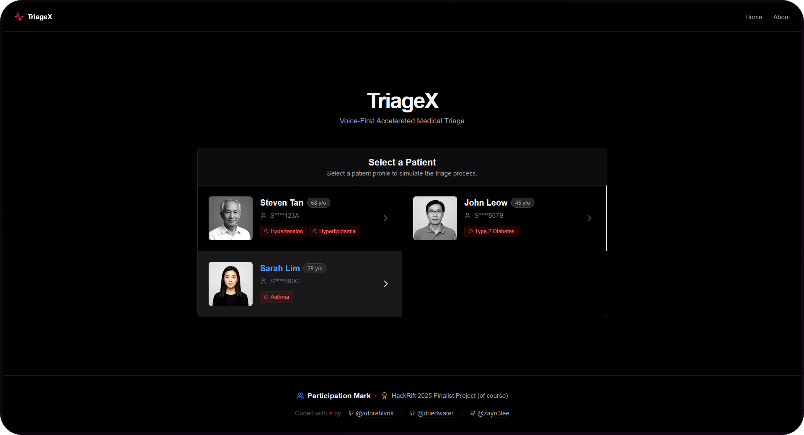
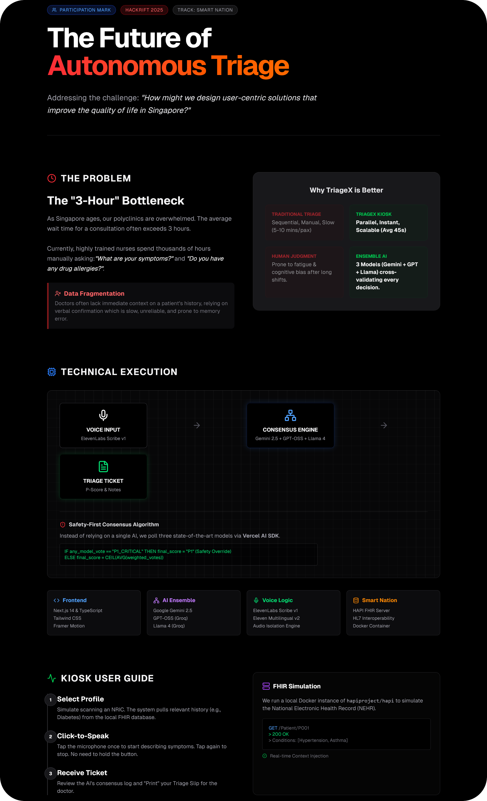
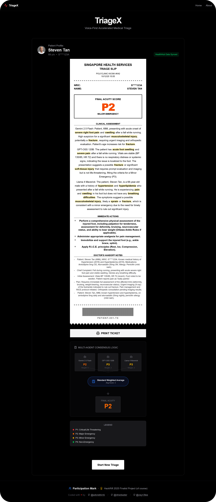

<div align="center">
  
  <h1>TriageX</h1>
  <p>
    Autonomous voice-first medical triage kiosk powered by a multi-agent AI ensemble designed to slash polyclinic wait times.
  </p>
  <p>
    <a href="https://hackrift-2025.devpost.com">
      
    </a>
  </p>
  <p>
    Built With: 
    <a href="https://nextjs.org">Next.js</a> &bull; 
    <a href="https://ai-sdk.dev">AI SDK</a> &bull;
    <a href="https://groq.com">Groq</a> &bull;
    <a href="https://deepmind.google/models/gemini/flash">Gemini 2.5</a> &bull;
    <a href="https://ai.meta.com/blog/llama-4-multimodal-intelligence">Llama 4</a> &bull;
    <a href="https://openai.com/index/introducing-gpt-oss">GPT-OSS</a> &bull;
    <a href="https://elevenlabs.io">ElevenLabs</a> &bull; 
    <a href="https://github.com/hapifhir/hapi-fhir-jpaserver-starter">HAPI FHIR</a> over H2 database &bull; 
    <a href="https://motion.dev">Motion</a>
  </p>
  <p>
    <b>By Team Participation Mark</b>
  </p>
  <p>
    Live Site: <a href="https://triagex.vercel.app">triagex.vercel.app</a>
  </p>
</div>

---

<details>
<summary>Table of Contents</summary>

- [About](#about)
  - [How It Works](#how-it-works)
- [Demo](#demo)
- [Getting Started](#getting-started)
  - [Prerequisites](#prerequisites)
  - [Installation](#installation)
  - [Execution](#execution)
- [Usage](#usage)
- [Credits](#credits)
- [Acknowledgements](#acknowledgements)
</details>

## About

<div align="center">  
  
</div>

**TriageX** is a next-generation medical kiosk interface designed for Singapore's Smart Nation initiative. It addresses the critical bottleneck in polyclinics where wait times often exceed 3 hours due to manual, repetitive triage processes.

<div align="center">  
  
</div>

### The Problem <!-- omit in toc -->

- **Wait Times:** Highly trained nurses spend thousands of hours manually asking basic symptom questions.
- **Data Fragmentation:** Doctors often lack immediate context on a patient's history, relying on unreliable verbal confirmation.
- **Resource Drain:** Minor ailments clog the system, delaying care for critical patients.

### The Solution <!-- omit in toc -->

TriageX is an onsite kiosk that interviews patients _while they wait_. It uses:

1. **Voice-First Interface:** Powered by ElevenLabs Scribe v1 for high-fidelity clinical transcription.
2. **Ensemble AI Core:** A "Safety-First" consensus engine running Gemini 2.5 Flash, GPT-OSS 120B, and Llama 4 Maverick simultaneously to cross-validate diagnoses.
3. **FHIR Integration:** Simulated real-time retrieval of chronic conditions (eg Hypertension) from the National Electronic Health Record (NEHR) to context-weight the risk assessment.

### Results <!-- omit in toc -->

<div align="center">  
  
</div>

### How It Works

TriageX operates on a sophisticated "Safety-First Weighted Consensus" algorithm.

1. **Input:** Voice audio is captured and isolated via **ElevenLabs**.
2. **Context Injection:** Patient history is fetched from a local **Dockerized HAPI FHIR Server**.
3. **Parallel Analysis:** The transcript and history are sent to 3 LLMs:
   - Gemini 2.5 Flash
   - GPT-OSS 120B
   - Llama 4 Maverick
4. **Consensus Logic:**
   - `IF` any model votes **P1 (Critical)** &rarr; **Override Final Score to P1**.
   - `ELSE` &rarr; Calculate weighted average of votes.

## Demo

<div align="center">
  <a href="https://youtu.be/SU16LazRYBA"></a>
  <p>Click to watch our demo on YouTube. Try TriageX live here: <a href="https://triagex.vercel.app">triagex.vercel.app</a></p>
</div>

## Getting Started

### Prerequisites

- [Bun](https://bun.com)
- [Docker](https://www.docker.com)
- API Keys:
  - `GOOGLE_GENERATIVE_AI_API_KEY` from [AI Studio](https://aistudio.google.com/api-keys)
  - `GROQ_API_KEY` from [Groq](https://console.groq.com/keys)
  - `ELEVENLABS_API_KEY` from [ElevenLabs](https://elevenlabs.io/app/developers/api-keys)
  - `AGENT_ID` from [ElevenLabs Agents](https://elevenlabs.io/app/agents/new)

### Installation

1. Clone the repository
2. Install dependencies:
   ```bash
   bun i
   ```
3. Create an `.env` file in the root directory:
   ```env
   AGENT_ID=
   ELEVENLABS_API_KEY=
   GOOGLE_GENERATIVE_AI_API_KEY=
   GROQ_API_KEY=
   ```

### Execution

1. Start FHIR Server:
   ```bash
   docker pull hapiproject/hapi:latest
   docker run -p 8080:8080 hapiproject/hapi:latest
   ```
2. Start TriageX:
   ```bash
   bun dev
   ```

## Usage

1. **Select a Patient Profile:** Click on a card (e.g., "Steven Tan") to simulate scanning an NRIC. This loads their specific medical history from the FHIR server.
2. **Voice Interaction:**
   - **Tap to Speak:** Click the microphone icon once. It will turn red.
   - **Describe Symptoms:** Speak naturally (e.g., "I fell running and my ankle is swollen").
   - **Tap to Stop:** Click the square stop icon.
3. **Review Analysis:** Watch the "Processing HUD" as the 3 AI models debate the diagnosis.
4. **Print Ticket:** Once the "Triage Slip" is generated, click **Print Ticket** to generate a physical handout for the doctor.

## Credits

- [adore_blvnk](https://x.com/adore_blvnk)
- driedwater
- zayn3lee

## Acknowledgements

Organized By [SIT](https://www.singaporetech.edu.sg) & [SIT Developers Club](https://www.instagram.com/sitech.developersclub)

Sponsored By [NCS](https://www.ncs.co) & [Workato](https://www.workato.com)

Supported By [Lovable](https://lovable.dev)

<!-- Inspired by Best-README-Template (https://github.com/othneildrew/Best-README-Template) -->
<!-- Table of Contents generated by Markdown All in One (https://github.com/yzhang-gh/vscode-markdown) -->

<!-- Helpful notes:
- insert a centred image:
  <div align="center"></div>
-->
